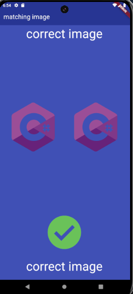

# matching_image

A new Flutter project.

# discription

Matching Image is a mobile app that helps you find matching pairs of images. It's a fun and engaging game that tests your memory and visual perception skills.

How to Play

The app will display a two images on the screen.
Tap the image to reveal a new image.
The goal is to keep tapping and revealing images until you find a match for the first image displayed.

# screenshoots

## Getting Started

This project is a starting point for a Flutter application.

A few resources to get you started if this is your first Flutter project:

- [Lab: Write your first Flutter app](https://docs.flutter.dev/get-started/codelab)
- [Cookbook: Useful Flutter samples](https://docs.flutter.dev/cookbook)

For help getting started with Flutter development, view the
[online documentation](https://docs.flutter.dev/), which offers tutorials,
samples, guidance on mobile development, and a full API reference.
